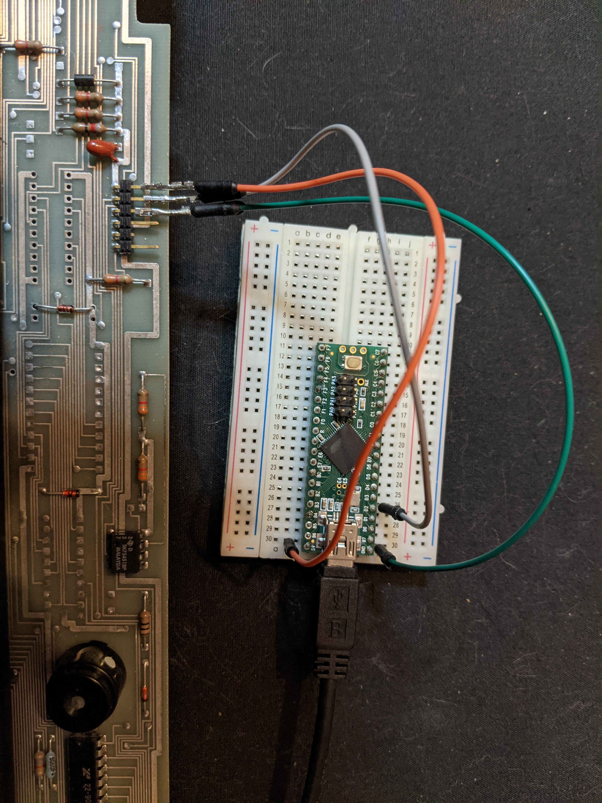

# Kaypro 2 Keyboard over USB

I acquired an old Kaypro 2 and decided it would be fun to refurbish. It seemed to boot fine but I could not get anything to type out in console. My first step was to replace the foam and foil pads as they had all pretty much dissolved. I found some pads at [Tex Elec](https://texelec.com/product/foam-capacitive-pads-keytronic/), really good site would recommend shopping with them. They went in pretty easy and upon trying again I still was getting nothing. At this point I'm unsure if the keyboard even works, time for some testing on a known working machine, but the Kaypro uses a telephone cable to plug in the keyboard...

 So I grab a spare microcontroller which happened to be a teensy 2+( absolute overkill for this) and I proceeded to hook up the keyboard to see if I could read any signal. At this point I need to give a shout out to [impressivemachines](https://github.com/impressivemachines/Kaypro) for doing a lot of the legwork. His repo helped me get a running start. Check it out if you are interested in some of the working detials of the board.

  Here is a closeup of the wiring I used. Orange is 5v green is ground and grey is serial out. The unused pins are case ground and on the far right the serial in. From here I loaded up the serial library in Teensyduino and to my pleasant surprise the keyboard spoke ascii, for the most part. After finding a nicely formatted map of ascii to hid_codes inside the some code in the arduino standard library I was upa and running. The final hurdle was getting the num pad to work since it wasn't standard ascii or even in a nice sequence. I kinda brute forced that part, it isn't the worst but it's not winning any beauty contests.

 My Future plans is to integrate the Teensy into the Keyboard case(its a very roomy case) so it will have a permanent USB option, for those times when you want a really loud very bad keyboard.
